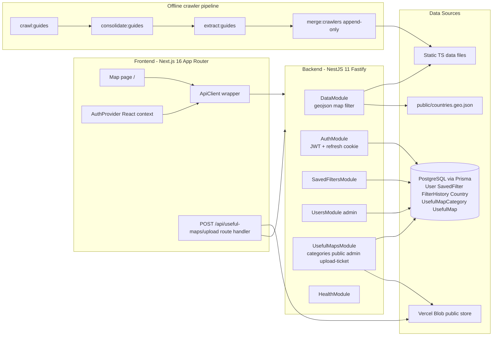
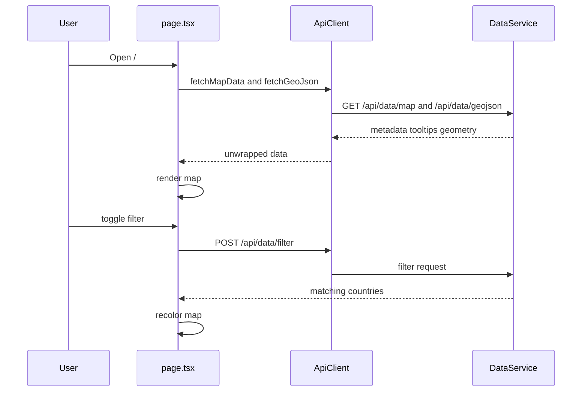
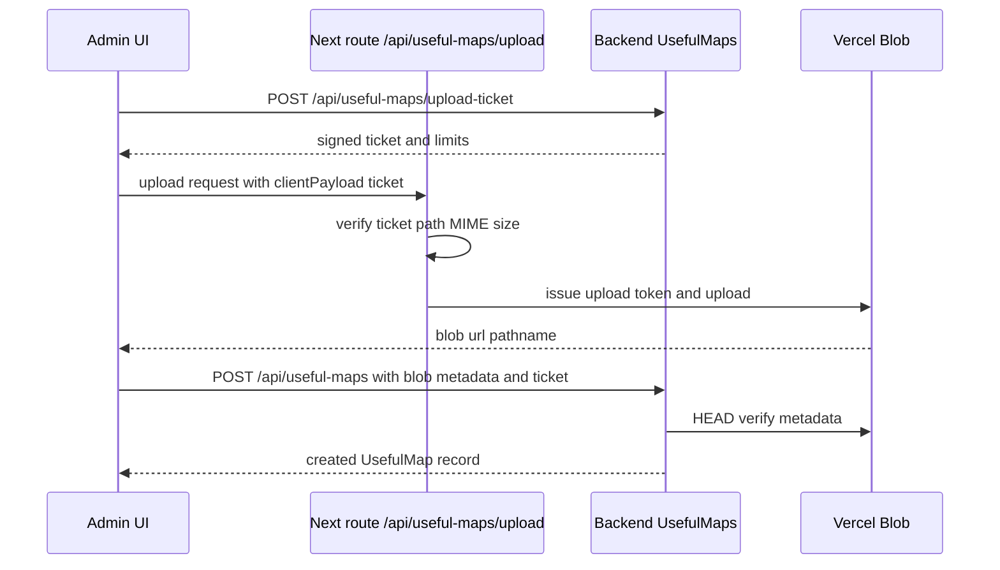
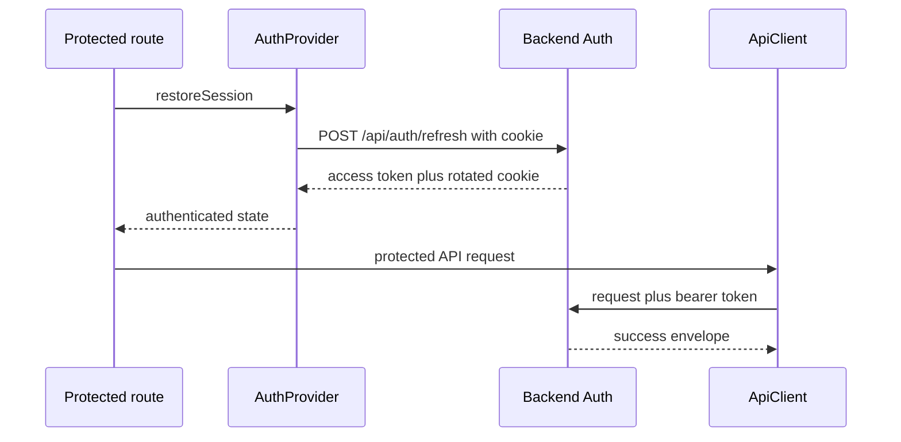

# GeoGuessr Helper - How It Works

A deep dive into the architecture and runtime behavior of GeoGuessr Helper. This document explains what each part of the system does and how the pieces fit together.

---

## 1. What the App Does

GeoGuessr Helper is a web app that helps players identify countries in GeoGuessr by visualizing geographic meta clues on an interactive world map. Players toggle filters such as driving side, road-line markings, EU license plates, Street View camera generation, coverage year, car color, and vehicle type, and the map highlights countries that match.

Beyond the core map, the app includes:

- Authenticated accounts with saved filter presets that can be kept private or shared publicly.
- A US license-plate explorer with a state map and plate gallery filtered by color.
- A Useful Maps gallery of reference images.
- An admin dashboard for user management.
- An admin Useful Maps management panel with upload, edit, delete, and cleanup retry actions.

---

## 2. High-Level Architecture

The project is a pnpm workspace with a Next.js frontend, a NestJS backend, and an offline crawler pipeline.



### Technology stack

| Layer                     | Technology                                                                                      |
| ------------------------- | ----------------------------------------------------------------------------------------------- |
| Frontend                  | Next.js 16 App Router, React 19, TypeScript, Tailwind CSS v4                                    |
| Map rendering             | Leaflet plus react-leaflet loaded client-side only with next dynamic and ssr false              |
| Backend                   | NestJS 11 on Fastify                                                                            |
| Auth                      | nestjs jwt, HttpOnly refresh-token cookie, scrypt password hashing                              |
| Database and ORM          | PostgreSQL via Prisma 7 with prisma adapter pg                                                  |
| Blob storage              | Vercel Blob with signed upload ticket flow                                                      |
| Validation                | class-validator and class-transformer DTOs                                                      |
| Caching and rate limiting | In-memory fallback with optional Upstash Redis REST backend and fail-open or fail-closed policy |
| API docs                  | Swagger at /api/docs                                                                            |
| Crawler                   | Puppeteer-based scraper with optional Anthropic SDK extraction                                  |
| Deployment                | Vercel frontend and backend                                                                     |

---

## 3. Backend

The backend is the source of truth for map geometry, metadata, filtering, tooltip composition, auth, and persistence.

### 3.1 Bootstrap and global setup

- backend/src/main.ts creates the Nest app with FastifyAdapter, calls setupApp, and listens on 0.0.0.0 with PORT default 3001.
- backend/src/app-setup.ts configures:
  - CORS origin allow-list with localhost, configured origins, and project Vercel preview patterns.
  - Allowed CORS methods include GET, HEAD, POST, PUT, PATCH, DELETE, OPTIONS.
  - Fastify cookie support.
  - Global ValidationPipe with whitelist, forbidNonWhitelisted, and transform.
  - Global exception filters.
  - Global response interceptor.
  - Global prefix api and Swagger docs.
- backend/src/app.module.ts registers feature modules, middleware, and global rate-limit guard.

### 3.2 Standard response envelope

Successful responses are wrapped as:

```json
{
  "success": true,
  "data": {},
  "timestamp": "2026-01-01T00:00:00.000Z",
  "path": "/api/data/map",
  "correlationId": "..."
}
```

The frontend ApiClient unwraps data automatically. Errors follow a parallel success false envelope.

### 3.3 Data module

backend/src/modules/data exposes:

| Method and route      | Purpose                                                   | Caching                          |
| --------------------- | --------------------------------------------------------- | -------------------------------- |
| GET /api/data/geojson | Returns country boundaries from public/countries.geo.json | Cache-Control plus memoized load |
| GET /api/data/map     | Returns country metadata and server-built tooltip HTML    | Cache-Control                    |
| POST /api/data/filter | Returns matching country names for a filter payload       | Cached filter results            |

DataService builds metadata, computes filtered countries, and builds tooltip HTML on the server.

### 3.4 Useful Maps module

backend/src/modules/useful-maps provides:

- Public endpoints:
  - GET /api/useful-maps/categories
  - GET /api/useful-maps/public
- Admin endpoints:
  - GET /api/useful-maps/admin
  - POST /api/useful-maps/upload-ticket
  - POST /api/useful-maps
  - PUT /api/useful-maps/:id
  - DELETE /api/useful-maps/:id
  - POST /api/useful-maps/cleanup
  - POST /api/useful-maps/cleanup/retry

Key behavior:

- Upload tickets are signed JWT-like tokens with issuer, audience, path prefix, MIME allow-list, size limit, expiry, and admin subject.
- Ticket subject must match the requesting user.
- Upload pathname is validated against the ticket prefix with safe stem-extension matching.
- Blob metadata is verified against storage HEAD checks before record creation.
- Delete flow is database row first, then blob delete with retry queue fallback.
- Failed blob deletions are queued in cache and can be retried by admin endpoint.
- Public list results use a versioned cache key for invalidation on writes.

### 3.5 Filter validation

backend/src/modules/data/dto/filter-request.dto.ts derives accepted filter values from data files where possible to keep enums aligned with dataset content.

### 3.6 Authentication and authorization

backend/src/modules/auth handles:

- Register, login, refresh, logout, and me.
- Password hashing with Node scrypt stored as scrypt$salt$hash.
- Access token in JSON response body.
- Refresh token in HttpOnly cookie named refresh_token.
- Refresh and logout include origin checks.
- Logout revokes by refresh cookie and clears local session even if revocation fails.
- RolesGuard plus Roles ADMIN for restricted routes.
- ADMIN_EMAILS auto-promotes listed emails.

### 3.7 Saved filters

backend/src/modules/saved-filters provides CRUD and public gallery:

- Ownership checks on private operations.
- Public listing is paginated, rate-limited, and cached with version-key invalidation.

### 3.8 Users module

backend/src/modules/users is admin-only and supports create, list, get-by-id, and delete.

Delete protections:

- Admin cannot delete self.
- User with uploaded useful maps cannot be deleted until those maps are removed.

### 3.9 Common cross-cutting utilities

| Concern         | Implementation                                                       |
| --------------- | -------------------------------------------------------------------- |
| Logging         | common/logger with correlation context                               |
| Correlation IDs | common/middlewares/correlation.middleware                            |
| Exceptions      | common/filters/http-exception.filter and validation.exception.filter |
| Response shape  | common/interceptors/response.interceptor                             |
| Cache store     | common/cache/cache.store with optional Upstash backend               |
| Rate limiting   | common/rate-limit decorator, guard, store                            |
| Pagination      | common/utils/pagination                                              |

### 3.10 Persistence and schema

Prisma models in backend/prisma/schema.prisma include:

- User
- SavedFilter
- FilterHistory
- Country
- UsefulMapCategory
- UsefulMap

UsefulMap relations use onDelete Restrict for both category and uploader links to prevent unsafe cascades.

### 3.11 Health checks

- GET /api/health for liveness
- GET /api/health/ready for dependency-aware readiness checks

---

## 4. Frontend

### 4.1 App shell

- src/app/layout.tsx wraps children with AuthProvider and renders Navbar.
- Main routes include /, /login, /register, /dashboard, /filters, /us-plates, and /useful-maps.

### 4.2 Map page

src/app/page.tsx:

1. Fetches map metadata and GeoJSON in parallel.
2. Holds seven filter states.
3. Calls backend filter endpoint when filters change.
4. Computes map colors and reads tooltip HTML delivered by backend.
5. Sanitizes and applies saved or shared filter payloads.

### 4.3 Map rendering

Leaflet is client-only in components/WorldMap.tsx and loaded with client-side patterns only.

### 4.4 Useful Maps frontend flow

- Public page src/app/useful-maps/page.tsx is a server component shell that renders client component UsefulMapsBrowser.
- UsefulMapsBrowser fetches categories and paginated public map entries from backend APIs.
- Admin dashboard renders UsefulMapsAdminPanel for upload and management.

Upload path:

1. Admin requests upload ticket from backend.
2. Browser uploads file through src/app/api/useful-maps/upload/route.ts.
3. Route validates ticket claims and upload path/MIME/size.
4. Frontend sends blob metadata and ticket to backend create endpoint.

### 4.5 API layer

src/lib/api/client.ts:

- Injects bearer token from AuthProvider in-memory access token.
- Sends cookies with credentials include.
- Retries one time after 401 using token refresher except on refresh endpoint itself.
- Unwraps backend success envelope and throws ApiError on failures.

### 4.6 Frontend auth

src/lib/auth/AuthProvider.tsx:

- Access token is in-memory only.
- Refresh token is cookie-only.
- Registers ApiClient token hooks.
- restoreSession is explicit and route-driven.
- Refresh uses single-flight behavior to avoid rotation races.
- sessionEpochRef prevents stale in-flight refresh from restoring after logout.
- A cooldown guard blocks rapid repeated refresh attempts while clearly unauthenticated.

### 4.7 Other frontend features

- /us-plates interactive map and color filtering
- /filters public saved-filter gallery
- /dashboard admin user management plus Useful Maps admin panel

---

## 5. Request lifecycles

### 5.1 Map load and filtering



### 5.2 Useful Maps upload



### 5.3 Authenticated request with explicit restore



---

## 6. Offline crawler pipeline

Four stages remain:

1. crawl:guides
2. consolidate:guides
3. extract:guides
4. merge:crawlers append-only

Generated artifacts under backend/crawlers/data are not source-of-truth files and should not be committed.

---

## 7. Configuration and environment

| Variable                                            | Scope                         | Purpose                                           |
| --------------------------------------------------- | ----------------------------- | ------------------------------------------------- |
| NEXT_PUBLIC_API_BASE_URL                            | Frontend                      | Backend base URL                                  |
| NODE_ENV                                            | Frontend and backend          | Environment behavior                              |
| PORT                                                | Backend                       | Listen port                                       |
| DATABASE_URL                                        | Backend                       | PostgreSQL connection                             |
| JWT_SECRET and JWT_REFRESH_SECRET                   | Backend                       | Access and refresh token signing                  |
| ADMIN_EMAILS                                        | Backend                       | Auto-promoted admins                              |
| CORS_ORIGIN and FRONTEND_URL                        | Backend                       | Additional allowed origins                        |
| UPSTASH_REDIS_REST_URL and UPSTASH_REDIS_REST_TOKEN | Backend                       | Optional shared cache and rate-limit backend      |
| CACHE_OUTAGE_POLICY                                 | Backend                       | Cache fallback mode fail-open or fail-closed      |
| RATE_LIMIT_OUTAGE_POLICY                            | Backend                       | Rate-limit fallback mode fail-open or fail-closed |
| GUIDE_SOURCE_BASE_URL and optional crawler vars     | Backend crawler               | Scraper source and behavior                       |
| USEFUL_MAPS_UPLOAD_TICKET_SECRET                    | Backend and Next upload route | Upload ticket signature key                       |
| USEFUL_MAPS_UPLOAD_TICKET_ISSUER                    | Backend and Next upload route | Ticket issuer                                     |
| USEFUL_MAPS_UPLOAD_TICKET_AUDIENCE                  | Backend and Next upload route | Ticket audience                                   |
| USEFUL_MAPS_BLOB_PATH_PREFIX                        | Backend                       | Allowed blob prefix                               |
| USEFUL_MAPS_ALLOWED_MIME_TYPES                      | Backend                       | Upload MIME allow-list                            |
| USEFUL_MAPS_MAX_UPLOAD_BYTES                        | Backend                       | Upload size limit                                 |
| USEFUL_MAPS_PUBLIC_CACHE_TTL_SECONDS                | Backend                       | Public list cache TTL                             |
| USEFUL_MAPS_PUBLIC_PAGE_SIZE_MAX                    | Backend                       | Public list max page size                         |

Upstash is optional. Without it, cache and rate limiting fall back to per-instance memory based on policy settings.

---

## 8. Quality gates and commands

- Frontend dev: pnpm dev
- Backend dev: pnpm dev:backend
- Both: pnpm dev:all
- Frontend build: pnpm build
- Backend build: pnpm build:backend
- Frontend tests: pnpm test
- Backend tests: pnpm --filter geoguessr-helper-backend test
- Backend hardening checks: pnpm --filter geoguessr-helper-backend hardening:check
- Backend seed: pnpm --filter geoguessr-helper-backend prisma:seed
- Useful maps legacy import: pnpm --filter geoguessr-helper-backend migrate:useful-maps
- Full local CI: pnpm ci

Git hooks enforce staged typecheck, eslint, prettier, related tests, conventional commit messages, and pre-push validation.

---

## 9. Key design principles

- Backend owns data, filtering, and tooltip composition.
- Leaflet remains client-only.
- DTO validation and contracts stay strict.
- Refresh token is cookie-only, not localStorage.
- Session restore is explicit on auth-sensitive surfaces.
- Shared-store behavior is policy-driven with fail-open or fail-closed controls.
- Responses are standardized and centrally unwrapped by the frontend API client.
- Useful Maps lifecycle prioritizes consistency: ticketed uploads, metadata verification, row-first delete, and retryable blob cleanup.
